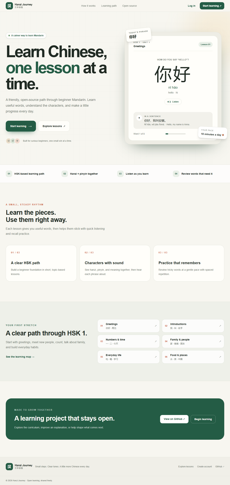

# Hanzi Journey

**Learn Chinese, one lesson at a time.** Hanzi Journey is an open-source Mandarin learning app for beginners, with a focused HSK 1 starter path, character and pinyin practice, browser pronunciation, saved progress, and spaced review.

> HSK is used to describe the learning level. The curriculum is community-authored and is not affiliated with or endorsed by the official HSK organization.

## Screenshots



## Demo

A hosted demo is not configured yet. Follow the local setup below to run the app.

## Features

- Fifteen short lessons across five beginner themes, with 120 vocabulary entries in JSON files.
- Hanzi, tone-marked pinyin, English meaning, example sentences, and browser text-to-speech with a `zh-CN` voice request.
- Seven reusable exercise formats: character/English, English/character, character/pinyin, pinyin/character, sentence translation, fill-in-the-blank, and mixed choice.
- Server-verified quiz scores, XP, lesson completion, daily streaks, achievements, vocabulary accuracy, and review scheduling.
- Secure email/password accounts with Auth.js credentials and bcrypt password hashes.
- PostgreSQL persistence through Prisma 7 and the `pg` driver adapter.
- Responsive learner navigation, progress, review, profile, and settings screens.

## Tech stack

Next.js App Router, React, TypeScript, Tailwind CSS, shadcn/ui-compatible configuration, Auth.js, Prisma ORM 7, PostgreSQL, Vitest, and Playwright.

## Architecture

```text
app/                 Next.js pages, layouts, route handlers, and styles
components/          Shared site, auth, and learning interface
content/hsk1/        Validated JSON curriculum, grouped by unit and lesson
lib/auth/            Auth.js setup, route guards, and account actions
lib/lessons/         Content loader, exercise generation, and scoring
lib/progress/        XP, streak, progress persistence, and server actions
lib/spaced-repetition/Review scheduling policy
prisma/              PostgreSQL schema, migration, and content seed
tests/unit/          Learning and progress logic tests
tests/e2e/           Playwright learner journey
types/               Shared content, exercise, and session types
```

The browser submits answer IDs and selected answers; the server rebuilds the exercise key from the curriculum before saving scores. Prisma is initialized in a server-only module. Importing the client does not query PostgreSQL, so static pages can build without a running database.

## Local installation

Use Node.js 24 and npm. A PostgreSQL database is needed for registration, login, and saving learner progress. Create a database project with a PostgreSQL provider such as Supabase or Neon, then copy its PostgreSQL connection string from the provider dashboard.

```bash
git clone https://github.com/mohammadhussain19/hanzi-journey.git
cd hanzi-journey
npm install
cp .env.example .env
```

On PowerShell, use `Copy-Item .env.example .env` for the copy step.

Set the values in `.env`:

| Variable | Purpose |
| --- | --- |
| `DATABASE_URL` | PostgreSQL connection string from a local server, Neon, or Supabase. |
| `AUTH_SECRET` | Secret used by Auth.js to protect session cookies and tokens. Generate one with `npx auth secret` or `node -e "console.log(require('node:crypto').randomBytes(32).toString('base64url'))"`. |
| `NEXT_PUBLIC_APP_URL` | Public app origin, `http://localhost:3000` for local development. |

Never commit `.env` or production credentials. `.env.example` contains blank secret/database values and is safe to commit.

The database stores learner accounts and learning data in PostgreSQL tables. In Supabase, open the project dashboard and use **Table Editor** to inspect tables, or **SQL Editor** for read-only reporting queries. The `User` table contains account email, display name, creation date, XP, streak, current level, and last learning activity. Passwords are stored only as bcrypt hashes; never query, export, or share password hashes.

For example, this query lists registered learners and learning activity without selecting password data:

```sql
SELECT email, name, "createdAt", "lastActivityDate", xp, "currentStreak", "currentLevel"
FROM "User"
ORDER BY "createdAt" DESC;
```

The current MVP has learner accounts but no manager role or in-app user administration page. It does not record login events; `lastActivityDate` means last learning activity, not last sign-in. Use the database provider's protected dashboard for authorized account reports.

Apply the migration and seed the HSK 1 lesson/vocabulary tables:

```bash
npm run db:migrate
npm run db:seed
npm run dev
```

Open [http://localhost:3000](http://localhost:3000). The landing page and course overview can be explored without an account; account, lesson progress, and review features require the configured database and `AUTH_SECRET`.

## Commands

| Command | Description |
| --- | --- |
| `npm run dev` | Start the local Next.js server. |
| `npm run lint` | Run ESLint. |
| `npm run typecheck` | Generate Prisma Client, then run TypeScript checks. |
| `npm test` | Run Vitest unit tests. |
| `npm run test:e2e` | Run Playwright browser tests. The account/lesson flow requires `DATABASE_URL`, `AUTH_SECRET`, a migrated database, and seeded content. |
| `npx playwright install chromium` | Install the browser used by the Playwright config. |
| `npm run build` | Generate Prisma Client and create a production build. |
| `npm run start` | Serve the production build. |
| `npm run db:migrate` | Create/apply a migration during local development. |
| `npm run db:deploy` | Apply committed migrations in a deployment. |
| `npm run db:seed` | Seed lesson, vocabulary, and achievement catalog data. |

## Database and deployment

The app can use PostgreSQL from Supabase, Neon, or another compatible provider. Configure `DATABASE_URL` in Vercel project settings, add a strong `AUTH_SECRET`, and set `NEXT_PUBLIC_APP_URL` to the deployed origin. Use a connection URL accepted by `node-postgres`; keep credentials and direct/migration URLs in platform secrets.

Build command: `npm run build`. Before serving a release, run `npm run db:deploy` against the production database. Seeding is only needed when loading or refreshing the curriculum catalog. The application build itself does not require a PostgreSQL connection.

Common deployment issues:

- **Missing Prisma Client:** confirm install/build scripts were not disabled, then run `npm run db:generate`.
- **Database connection errors:** check `DATABASE_URL`, provider network access, TLS settings, and connection limits.
- **Auth secret errors:** configure a unique `AUTH_SECRET`; do not reuse a development value in production.
- **Missing tables:** apply migrations with `npm run db:deploy` before the app handles learner requests.
- **Prisma engine download errors during install:** allow access to the npm registry and the exact Prisma engine artifact host used by the installed Prisma CLI. Do not suppress engine checks to work around network failures.

## Contributing

Read [CONTRIBUTING.md](CONTRIBUTING.md) before opening a pull request. Curriculum changes belong in the lesson JSON files and should include tone-marked pinyin, a clear meaning, and a natural beginner example sentence with pinyin and translation. Add tests for business-logic changes.

## Security

See [SECURITY.md](SECURITY.md) for vulnerability reporting. Passwords are hashed; scores and progress updates are checked on the server. Never include secrets in issues, logs, or commits.

## Roadmap

See [ROADMAP.md](ROADMAP.md) for planned curriculum and platform improvements.

## License

Released under the [MIT License](LICENSE).
